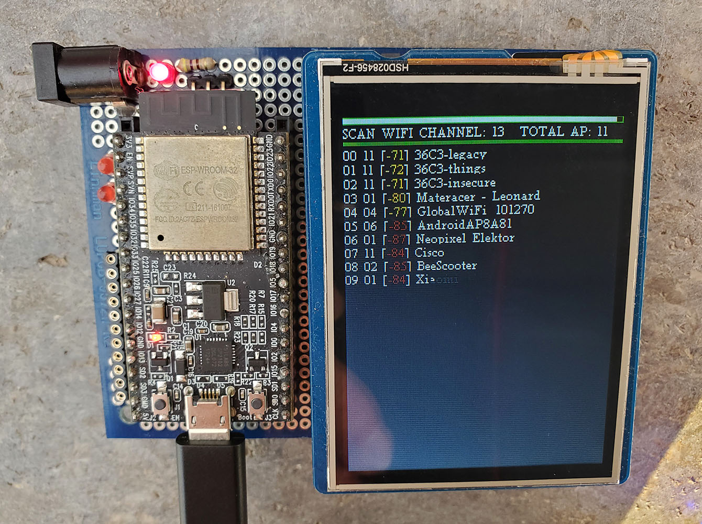
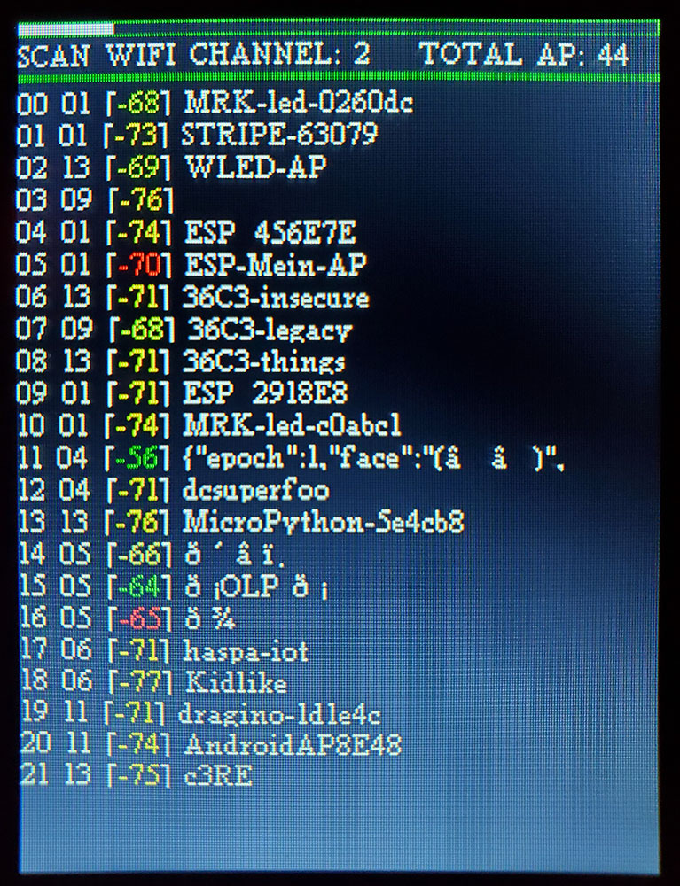

# ESP32 Wifi Sniffer with TFT Display

During 36C3 I spotted a sign for the "MysteryHack WiFi Fox Hunt" and a URL for https://fox.mysteryhack.space/. In true spirit of the event, I decided to code a Wifi AP identification screen with signal power on the ESP32 DevKitC. The goal
of fox hunting  is to find the physical location of an AP through measuring the signal power from different locations.

## Design

I am learning the ESP32 platform with a ESP32 DevKit board, using the Arduino IDE.
My board is connected to a 2.8" WaveShare TFT display over SPI, both the MCU and the TFT are soldered to a universal PCB. The onboard PCB antenna of the DevKitC 
board 

### Schematics

### Code

The arduino sketch is a collection of fragments from the internet, most notably
https://github.com/ESP-EOS/ESP32-WiFi-Sniffer  and https://github.com/michelep/ESP32_BeaconSniffer
Thanks and credits to Lukasz Podkalicki, Michele "O-Zone", and others for the Wifi protocol foundations.

## Wifi signal example during 36C3

